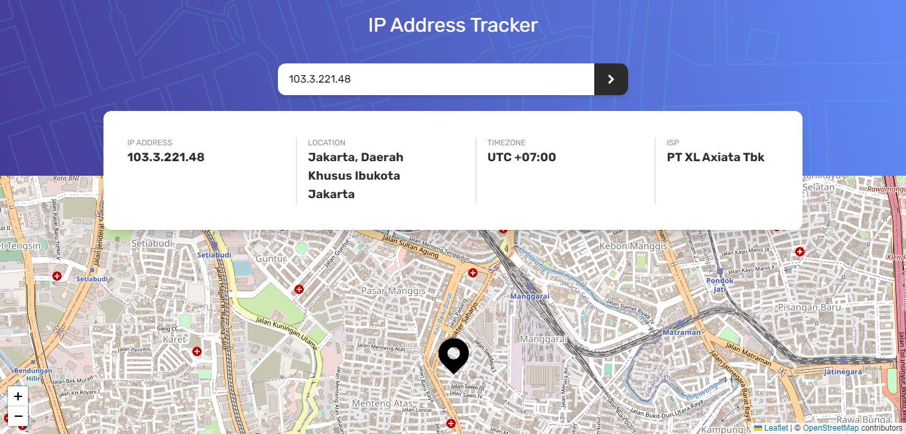
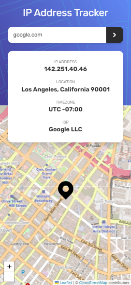

# Frontend Mentor - IP address tracker solution

This is a solution to the [IP address tracker challenge on Frontend Mentor](https://www.frontendmentor.io/challenges/ip-address-tracker-I8-0yYAH0)

## Overview

### The challenge

Users should be able to:

- View the optimal layout for each page depending on their device's screen size
- See hover states for all interactive elements on the page
- See their own IP address on the map on the initial page load
- Search for any IP addresses or domains and see the key information and location

### Screenshot

**Desktop**

**Mobile** 

### Links

- Solution URL: [Solution Code](https://github.com/abimh66/ip-address-tracker)
- Live Site URL: [Live Site](https://ipaddress-tracker-abimh66.netlify.app/)

### Built with

- Semantic HTML5 markup
- Flexbox
- Mobile-first workflow
- [React](https://reactjs.org/) - JS library
- [Vite](https://vitejs.dev/) - React framework
- [TailwindCSS](https://styled-components.com/) - For styles

### Useful resources

- [IP Geolocation API](https://geo.ipify.org/) - IP Geolocation API allows you to locate and identify website visitors by IP address
- [React Leaflet Map](https://react-leaflet.js.org/) - React components for Leaflet maps

## Author

- Frontend Mentor - [@abimh66](https://www.frontendmentor.io/profile/abimh66)
- Codewars - [@abimh66](https://www.codewars.com/users/abimh66)
- Twitter - [@abimhrdnt](https://www.twitter.com/abimhrdnt)
